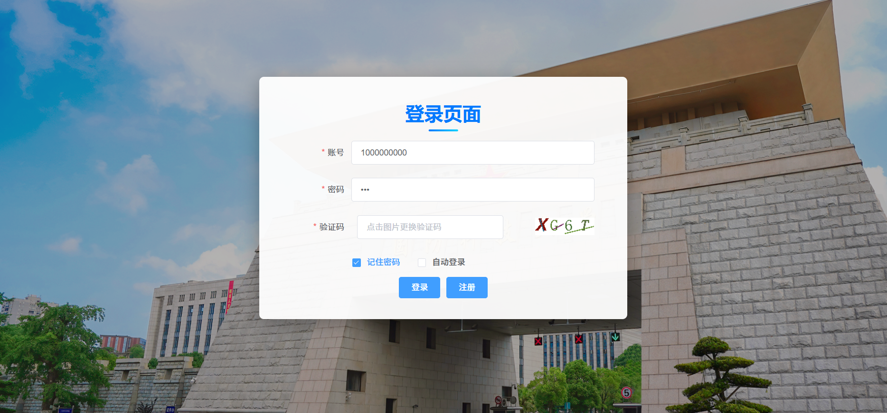
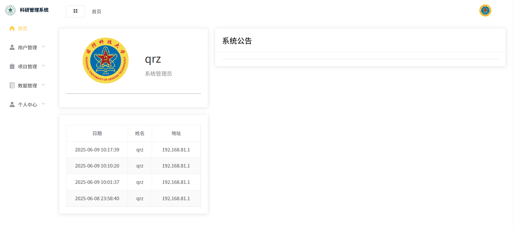
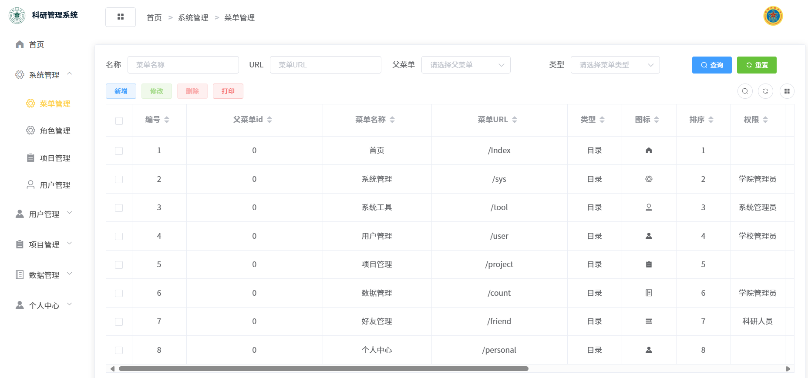
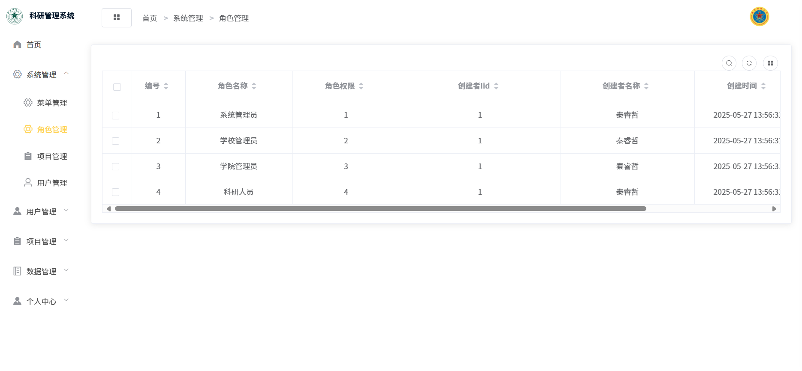
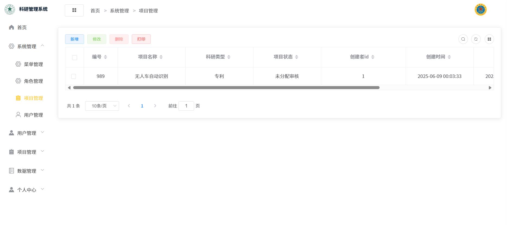
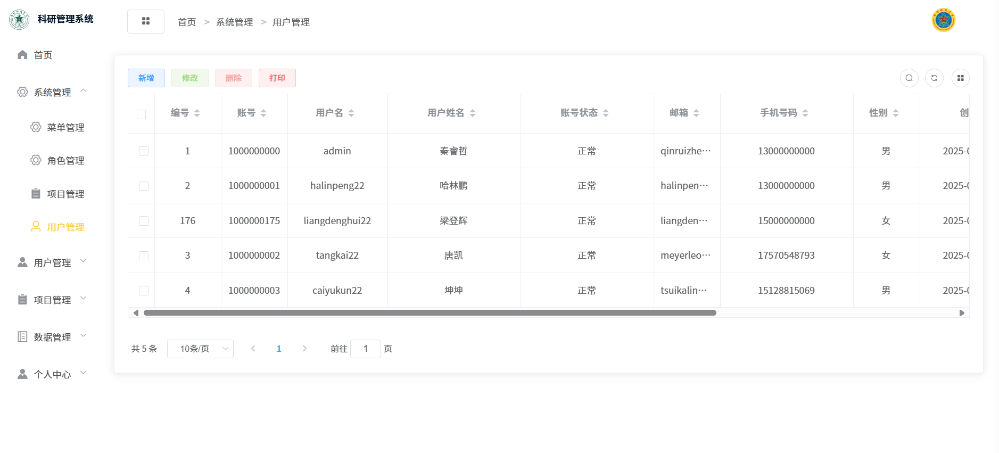
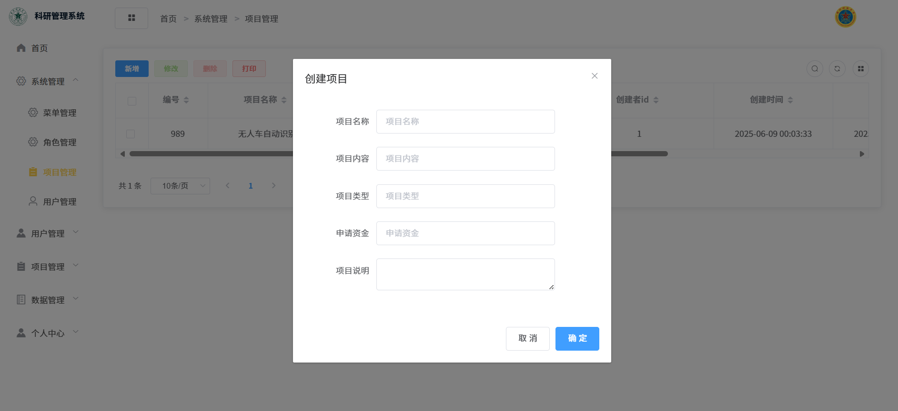
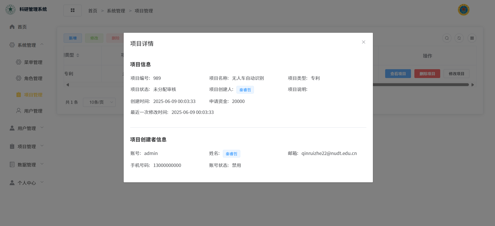

---

## ⚡ 介绍

本项目为基于SpringBoot+Vue+sa-token前后端分离的科研项目管理平台

<ul>
<li>前端采用Vue、Element UI</li>
<li>后端采用Spring Boot、Redis。</li>
<li><a href="https://sa-token.cc/doc.html#/">Sa-Token</a>：一个轻量级 java 权限认证框架。</li>
<li><a href="https://developer.mozilla.org/zh-CN/docs/Web/API/WebSocket">WebSocket</a>：WebSocket对象提供了用于创建和管理 WebSocket 连接，以及可以通过该连接发送和接收数据的 API。</li>
</ul>

## 💻 环境要求
- Java 17.0.13（Eclipse Adoptium JDK）
- Maven 3.9.10
- MySQL 8.0.42
- Node.js 22.16.0


## 截图

<table>
   <tr>
        <td></td>
        <td></td>
   </tr>
   <tr>
        <td></td>
        <td></td>
   </tr>
   <tr>
        <td></td>
        <td></td>
   </tr>
   <tr>
        <td></td>
        <td></td>
   </tr>
</table>

## 📦 项目结构解析  
1. **.vscode目录**：包含VSCode的配置文件，如`launch.json`和`settings.json`，用于设置开发环境的调试和编辑器配置。
2. **Redis-x64-5.0.9目录**：存放Redis服务器的可执行文件和配置文件，用于本地开发和测试中的缓存服务。
3. **Resources目录**：包含图像和SQL脚本，用于存储静态资源和数据库初始化脚本。
4. **logs目录**：存放系统日志文件，记录应用程序的运行日志和错误信息。
5. **output目录**：由`dir_analyzer.py`生成的分析报告，包含目录结构和文件类型统计。
6. **pom.xml**：Maven的项目对象模型文件，用于管理项目依赖和构建配置。
7. **srppms-admin等模块**：这些是Maven模块化工程，分别处理系统管理、通用组件、代码生成、邮件服务和系统核心功能。
8. **srppms-vue2目录**：前端Vue.js项目，包含公共资源、组件、路由和状态管理。

## 🌈 项目架构解析：

本项目包含完整的项目架构，主要模块功能如下：

1. **核心服务模块**
   - Redis服务组件，包含
     - 服务端程序（redis-server.exe）
     - 客户端工具（redis-cli.exe）
     - 持久化配置文件（redis.windows.conf）

2. **资源管理系统**
     - /images：UI素材库（PNG图标）
     - /sql：数据库初始化脚本

3. **日志管理系统**
     - 按日期分割的日志文件
     - 错误日志（sys-error.log）

4. **Maven模块化工程**  
   - srppms-admin：后台管理模块
   - srppms-common：通用组件库
   - srppms-generator：代码生成器
   - srppms-mail：邮件服务模块
   - srppms-system：系统核心模块

5. **前端工程**
     - /src/components：Vue组件库
     - /src/router：前端路由配置
     - vue.config.js：构建配置

6. **系统配置**
   - pom.xml：Maven依赖管理
   - 启动.txt：系统启动指引
   - .vscode/launch.json：调试配置


## ⭐️ 开始使用

### 注意事项：

#### 1.项目默认端口为8888，防止端口冲突。

#### 2.创建好数据库并执行无误后，可以关闭检查数据库的方法，以减少启动时间。

#### 3.登录密码全部为：123。

### 安装步骤


####  步骤 1：创建数据库和用户

使用 `mysql` 命令行登录数据库后，执行以下 SQL 命令：

```sql
CREATE DATABASE srppms;
CREATE USER 'qrz'@'localhost' IDENTIFIED BY '123456';
GRANT ALL PRIVILEGES ON paperdb.* TO 'qrz'@'localhost';
FLUSH PRIVILEGES;
```


#### 步骤 2：创建数据库结构（表结构）

win+R 输入cmd 进入命令行

```bash
cd D:\srppms-master\srppms-master\Resources\sql
```

在命令行中执行以下命令导入建表脚本：

```bash
mysql -u qrz -p123456 < srppms.sql
```

该脚本包括所有核心数据表的定义。

---


### 启动后端方法：

1. 启动前确保数据库配置正确，并在"\srppms-master\srppms-admin\src\main\resources\application.yml"目录下修改用户密码。
2. 启动后端 "\srppms-master\Redis-x64-5.0.9\redis-server.exe"
redis-server.exe"
3. 启动Spring Boot 应用程序 "\srppms-master\srppms-admin\src\main\java\com\example\StartApplication.java
StartApplication.java"

### 启动前端方法：

1. 终端地址cd到srppms-vue2模块下，输入命令”npm i“更新本地环境。
2. 启动前端服务 "\srppms-master\srppms-vue2\package.json
package.json"


[//]: #
